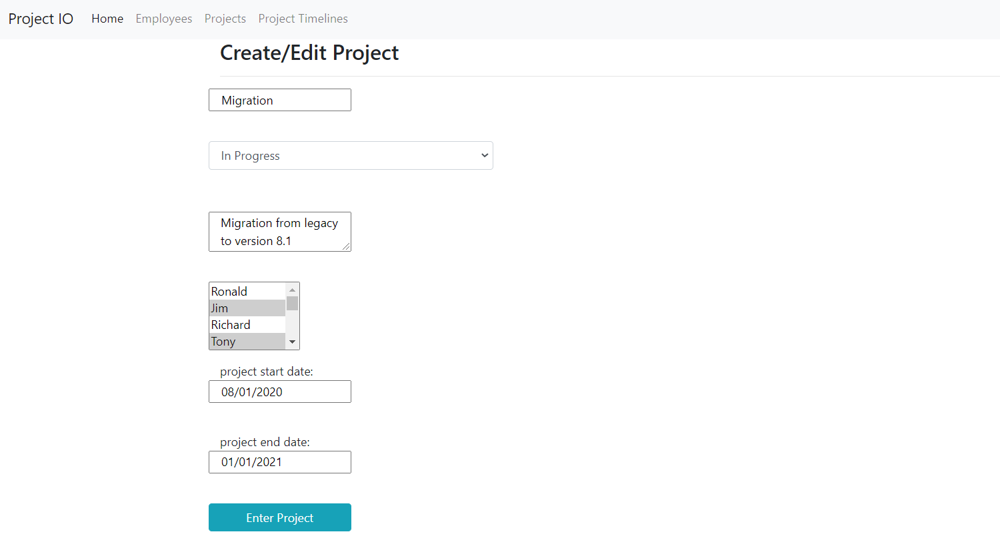

# Project Management
A CRUD application written in Spring boot framework.

## Content
1. Specifications
2. Libraries, frameworks, tools and platforms used

## Specifications

### Home dashboard
* Shows summary of projects by status and employees with project count:

### Projects
* Users can create/edit projects. 
* Each project should be assigned one of the following status: Not Started, In Progress, Completed
* Each project has fields: Name, Status, Description, associated list of employees, project start and end dates:

### Employee
* Users can create/edit employee
* Each employee has the following fields: First name, Last name, and email

* Pages to display Project and Employee lists:

## Libraries, frameworks, tools and platforms used
* Backend: Spring-boot, Spring data JPA
* Frontend: Thymeleaf, Bootstrap, JQuery, chart.js, Google charts
* Database: PostgreSQL
* Platforms deployed on: containerized using Docker
* Created and connected a DB instance on Amazon RDS